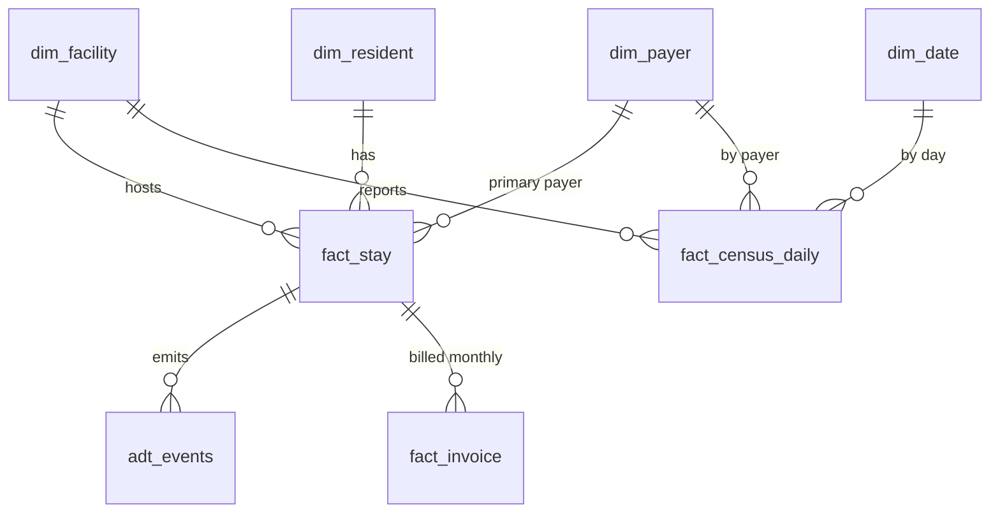

# synthetic-snf-data-generator

Generate a realistic, **fully fictional** skilled nursing facility (SNF) dataset: facilities, payers, residents, stays, ADT events, daily census, and monthly invoices with payment behavior. It exists so healthcare BI and data-platform work can be demonstrated, tested, and shared without any PHI.

It is the foundation for the other repos in this portfolio: [fabric-lakehouse-blueprint](https://github.com/shaunazamarripa-svg/fabric-lakehouse-blueprint) ingests it, and [powerbi-governance-framework](https://github.com/shaunazamarripa-svg/powerbi-governance-framework) uses it for its reference model.

## Why this exists

Healthcare data engineers can rarely share their work because the data is regulated. A synthetic generator solves that: the same modeling, governance, and KPI patterns can be shown publicly, and teams can build and test pipelines in non-production environments with data that has the right *shape* and no privacy risk.

## Quick start

Python 3.9+ and the standard library only. No installs.

```bash
python generate_snf_data.py --seed 42 --facilities 3 --start 2025-01-01 --end 2025-12-31 --out output
```

| Option | Default | Notes |
|---|---|---|
| `--seed` | 42 | Same seed produces identical files every run |
| `--facilities` | 3 | 1 to 8 facilities with different bed counts |
| `--start`, `--end` | 2025-01-01, 2025-12-31 | Simulation window (ISO dates) |
| `--out` | `output` | Folder for the CSV files (git-ignored) |

The default run produces roughly 1,200 stays, 6,500 daily census rows, and 4,200 invoices.

## What it produces



| File | Grain | Key columns |
|---|---|---|
| `dim_facility.csv` | One row per facility | `facility_id`, `region`, `licensed_beds` |
| `dim_payer.csv` | One row per payer | `payer_id`, `payer_category`, `synthetic_daily_rate` |
| `dim_date.csv` | One row per calendar day | `date`, `quarter`, `month_start`, `month_end` |
| `dim_resident.csv` | One row per resident | `resident_id`, `resident_label` ("Resident 000123"), `age_band` |
| `fact_stay.csv` | One row per stay (admit to discharge) | `admit_date`, `discharge_date` (blank if still in-house), `diagnosis_group`, `stay_type`, `discharge_disposition` |
| `adt_events.csv` | One row per admit or discharge event | `event_type` (A01-Admit, A03-Discharge), `event_timestamp` |
| `fact_census_daily.csv` | Facility x payer x day | `census_count`, `licensed_beds` |
| `fact_invoice.csv` | One row per stay per service month | `billed_amount`, `paid_amount`, `paid_date`, `invoice_status` (Paid, Short-Paid, Open) |

## Realism, and how it is checked

- Occupancy follows a seasonal curve (roughly 69% to 92% across the default year) and never exceeds licensed beds.
- Short-stay rehab and long-term care residents have different length-of-stay distributions and payer mixes (Medicare and managed care skew short-stay, Medicaid and private pay skew long-term).
- About 8% of admissions are readmissions of a previously discharged resident.
- Invoices are billed on the 5th of the following month. Payment lag differs by payer, and some invoices pay short, so downstream AR aging and days-in-AR calculations behave like real ones.
- `fact_census_daily` reconciles exactly to `fact_stay` (a resident counts on a day when `admit_date <= day < discharge_date`). This is a good first data-quality test to reproduce in your own pipeline.

## Privacy design

- Residents are numbered placeholders. There are no names, dates of birth, addresses, SSNs, MRNs, or free-text fields.
- Age is a band, sex is coarse, and dates are simulated.
- Payer rates are illustrative, not real reimbursement rates.
- Nothing here is derived from any real facility, employer, or patient record.

## Ideas for using it

- Load it into a Fabric Lakehouse and build a medallion pipeline (see the blueprint repo).
- Practice DAX for census, occupancy, average daily census, and days in AR.
- Test row-level security by facility or region.
- Build and demo AR aging, payer mix, and length-of-stay dashboards for a portfolio.

## Limitations

This is a teaching and testing dataset. It does not model clinical detail (MDS, diagnoses codes, therapy minutes), case-mix, or true reimbursement logic, and its statistics should never be used to benchmark real operations.

## License

MIT. See [LICENSE](LICENSE).
